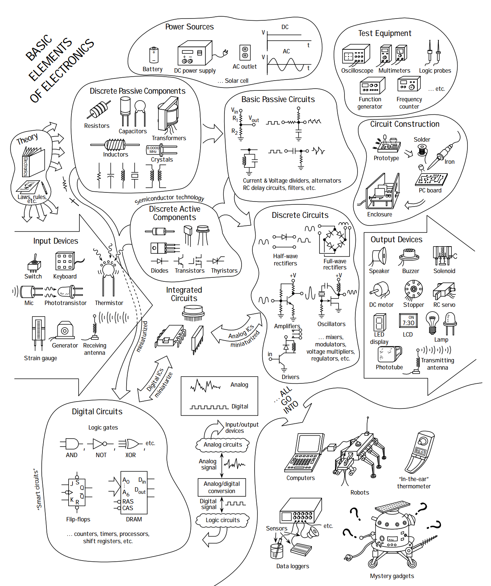

- textbook link: https://neuron.eng.wayne.edu/ECE330/Practical_Electronics_for_Inventors.pdf
- I only cover basics (ch1-4), and select components. Skipped:
	- optoelectronics
	- operational amplifiers
	- filter design
	- oscillators and timers
	- voltage regulators and power supplies
	- audio electronics
	- digital electronics (flip flops, counters, shift registers)

